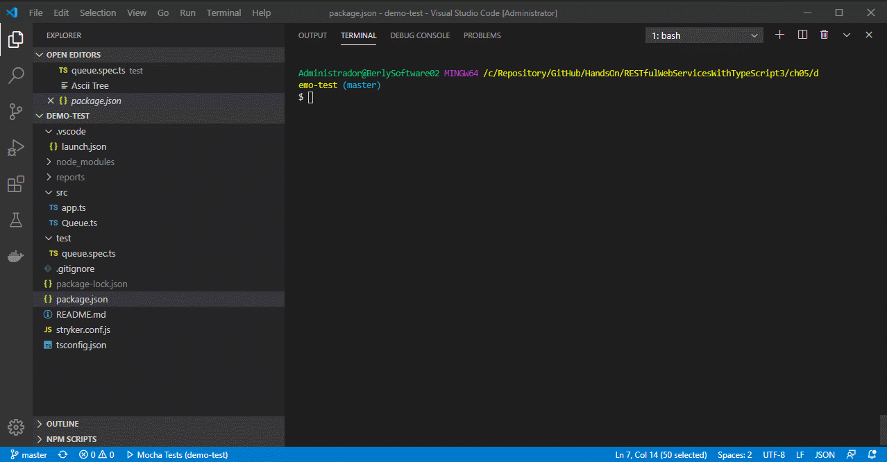
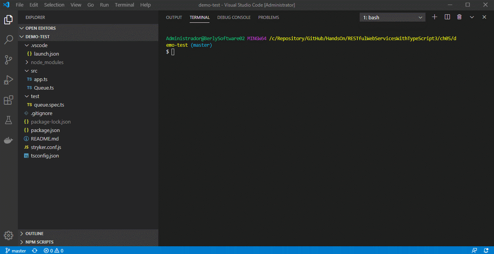

Este projeto, tem como objetivo demonstrar a utilização da suite de teste (**Mocha**, **Chai** e **Stryker Mutator**) em projetos em **Node.js**.

Para saber mais sobre a suite de teste utilizada, consulte a documentação dos fornecedores:
 - [mocha](https://mochajs.org/api/)
 - [chai](https://www.chaijs.com/api/)
 - [stryker-mutator](https://stryker-mutator.io/)

Neste projeto, utilizei um armazenamento em memória que representa uma lista de nomes (preenchi essa lista com os nomes das pessoas da minha antiga equipe cujo amei trabalhar) de pessoas, através de uma classe genérica `Queue` e algumas operações como:

 - **pop()**: que remove o último elemento da lista e o retorna
 - **shift()**: que remove o primeiro elemento da lista e o retorna
 - **push()**: que adiciona um novo elemento a lista
 - **isEmpty()**: que verifica se a lista está vazia
 - **size()**: que retorna a quantidade de elementos na lista
Com base nessa classe genérica, criei alguns testes para validar operações que o programa deve ser capaz de executar em `test/queue.spec.ts`.

Antes de realizar o download do projeto, instale globalmente os CLI's necessários para a execução dos testes.

**Para o Mocha:**

    npm install --g mocha
**Para o Chai:**

    npm install --g chai
**Para o Stryker Mutator:**

    npm install --g stryler-cli

Após o download é necessário instalar as dependências necessárias do projeto através do comando:

    npm install
Para executar o teste e ver seus resultados, execute o comando:

    npm test
Ao executar o comando ***npm test***, na verdade, você estará executando o comando:

    mocha --require ts-node/register test/**/*.spec.ts
Isso significa que irei executar os testes utilizando o `mocha`; já o `--require ts-node/register`, significa que vamos utilizar o Typescript como o transpilador em tempo de execução e; `test/**/*spec.ts` siginifica que nossos testes estão na paste `test` sob o nome de arquivos `*.spec.ts`

Para ver o Stryker-Mutator em ação, execute o comando:

    stryker run

Espero ter contriuido de algumar forma para o conhecimento de vocês!!! Até a próxima... tchau!!!
